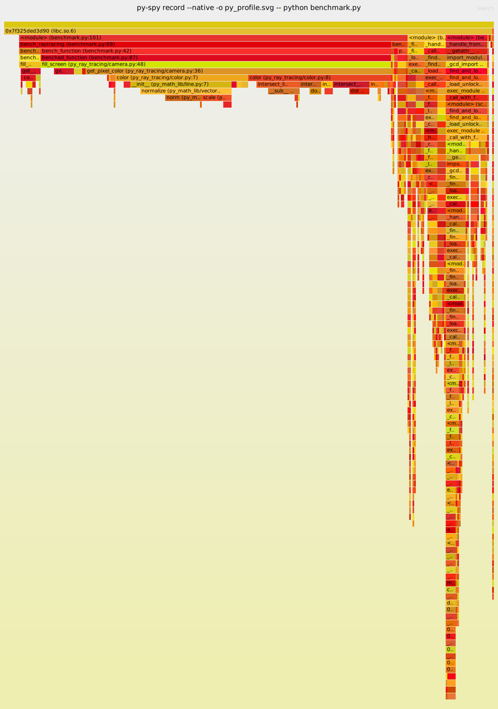
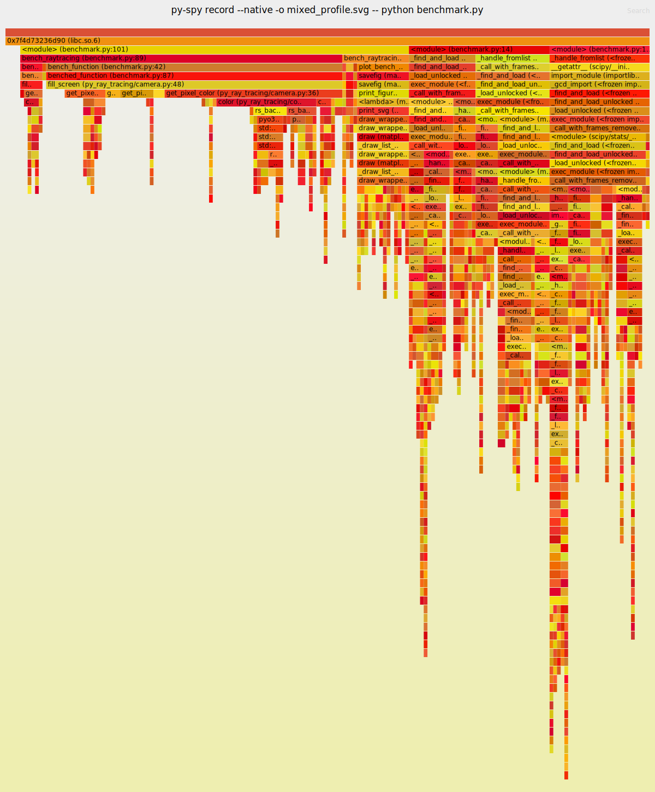
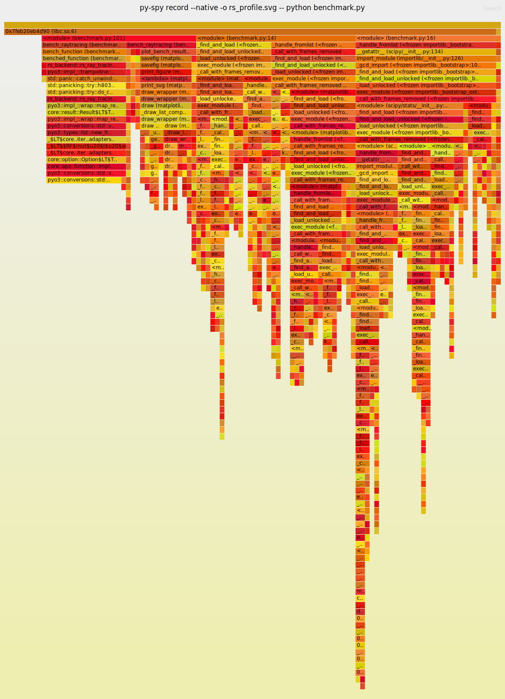
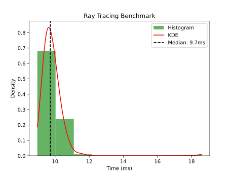
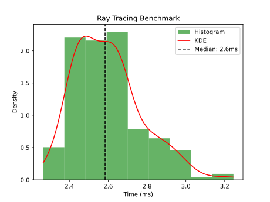
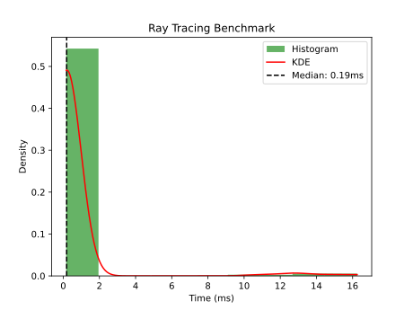

# Benchmarking PyO3

This repository aims to compare the runtime speed of a basic ray tracer

The benchmark and performance optimization focuses on three main steps:
 1. Pure python implementation
 2. Mixing a rust math library with python driver code
 3. Full rust implementation (driven from python)

## Code Structure

The entry point to the repository is the file `benchmark.py`. The first few
lines of this file define the backend selection:

```
import os

os.environ["MATH_BACKEND"] = "rust"
os.environ["RAYTRACING_BACKEND"] = "python"
```

The idea was to allow mixing the python and rust implementations as much as possible to test PyO3 as much as possible.

The code that defines both the math and ray tracer logic can be found under:
- Python: `./py_backend`
- Rust: `./rs_backend`


## Benchmarking and Performance Optimization

This document only aims to help identify where the bottlenecks are happening
and

### First look at python implementation
```
os.environ["MATH_BACKEND"] = "python"
os.environ["RAYTRACING_BACKEND"] = "python"
```
Using `py-spy` we can quickly generate a flame-graph of the python code. As expected, the function that takes the most time when rendering an image is `get_pixel_color`.

Looking a little bit more in detail we can break-down a little bit where are we spending most of the calculation time. Seems like slowness originates from `Vector3.norm` (i.e. calculating distances)

I have colored the <span style="background-color:rgb(0,150,0); color:white;">referred box</span> in green so that it can be spotted more easily.



### Rust Math Backend

```
os.environ["MATH_BACKEND"] = "rust"
os.environ["RAYTRACING_BACKEND"] = "python"
```

It is time to see the improvements that we get from switching to a rust backend.
Just by swapping the math backend, we can already notice quite a speed improvement (about 4x).

The non-obvious thing that we can see is the overhead in calling the rust function. `color.py:7`
took 15.52% of the total time, but rust-side, only spent 5.17% and 4.60% of the total.
Meaning there is around 5% of time that is pure call overhead.



### Math + RayTracer in Rust

```
os.environ["MATH_BACKEND"] = "rust"
os.environ["RAYTRACING_BACKEND"] = "rust"
```

Under this implementation, we have exposed to python a `Camera` class written in rust
that exposes an API to render the pixels of a given screen (via `fill_screen`).

Such implementation keeps the long-running for loops in the rusty-side of the program
and reduces much of the function overhead we were seeing before.

The stair-case pattern of the mixed implementation before is no longer visible under this implementation
and instead we only observe dense blocks.

This gave 50x speed improvement. There is a bit further optimization work we could start
doing on the rusty side, but it goes beyond profiling PyO3 and original objective of this project




### Summary of timings

From left to right, you can see below:
- Pure Python implementation
- Mixed Python/Rust implementation
- Pure Rust implementation (Library being called from python)

Compared to our initial implementation, we can see rust offering over 51x
speed improvement

<div style="display: flex;">
    <div style="flex: 33.33%; padding: 5px;">
        
    </div>
    <div style="flex: 33.33%; padding: 5px;">
        
    </div>
    <div style="flex: 33.33%; padding: 5px;">
        
    </div>
</div>
